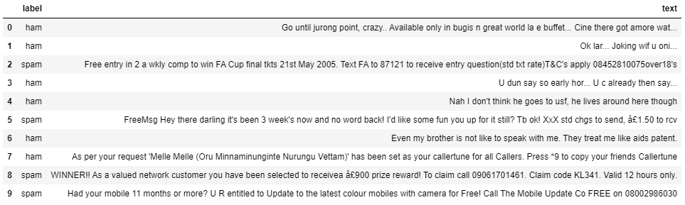
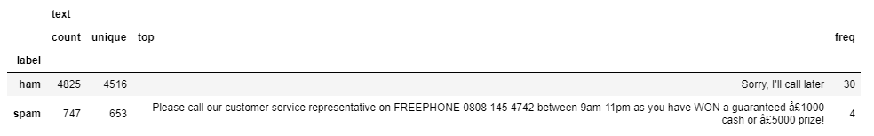
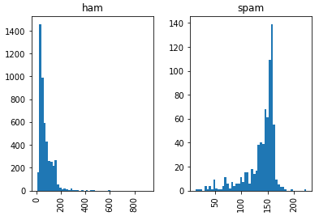
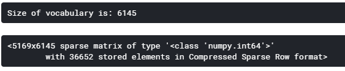
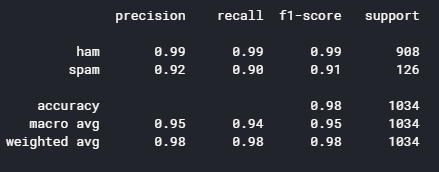
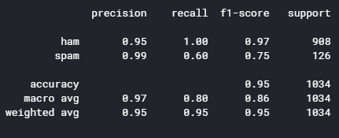
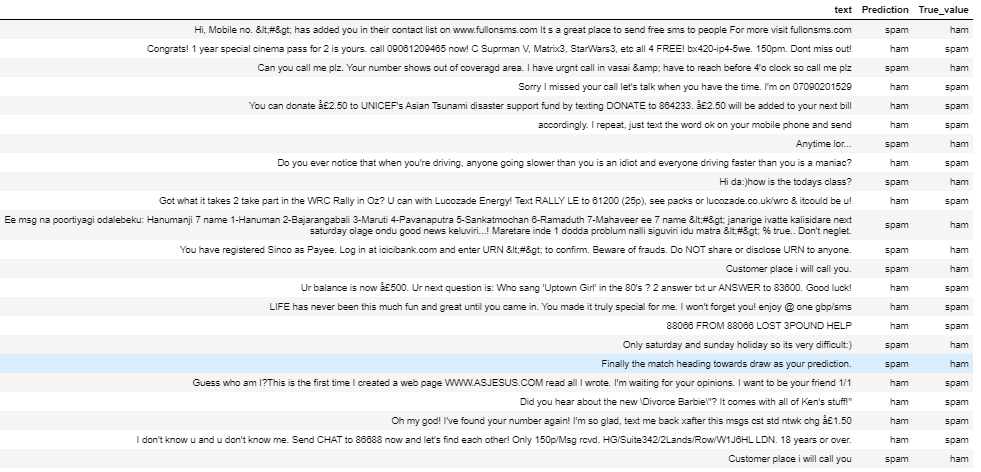

# Spam Classification with Naive Bayes model

The [UCI Spam Colletion Dataset](https://archive.ics.uci.edu/ml/datasets/SMS+Spam+Collection) is a dataset of labelled SMS colleted for mobile phone spam research. The SMS texts mostly come from UK and Singapore, and are collected from various free sources on the Internet. In this notebook I will build a simple Naive Bayes model to classify which SMS is spam and which is not. This is the classic 'Ham (not spam) or Spam' task in Natural Language Processing (NLP).

## 1. Load the data

 
  Table 1: First 10 rows of the table 

 
  Table 2: Summary table

According to the summary table, only around 13.4% of the observations are spams. In addition, there are some duplicate rows. This might be because of the SMS texts were collected not from one source and there were overlaps between the sources. We will remove the duplicates. This still leaves us with a lot of data to work with.

The charts above are the histograms of spam(right) and ham(left). As we can see, spam texts, which averages around 150 characters, are generally longer than ham, whose average is much lower than that. This discovery will play a part later in our analysis.

## 2. Text Preprocessing

For our Naive Bayes algorithm to understand the data we have to find a way to convert these texts into vectors. The most popular way is the **Bag-of-Words** (BoW) model. How it works is that we create a 'vocabulary' which contains all the words in our data, and assign each word in that vocabulary an index. Then each SMS text can be represented by a vector whose length is the size of that vocabulary, and each of its entries is the count/frequency of the word at that index. [Wikipedia] (https://en.wikipedia.org/wiki/Bag-of-words_model) has some nice examples of BoW.

Before turning our texts into a vocabulary, let's clean and tokenise the text. For each text, I perform the following steps:
- (1) Remove all punctuations, standalone (e.g. full stops) or as a part of a word (e.g. What's)
- (2) Remove stopwords. They are words that does not contribute much meaning to the sentences, thus is safe to remove (e.g. it's, hers,him,...).
- (3) Change all words to lowercase for consistency. This is important since the capitalisation of words are all over the place in SMS texts.
- (4) Remove all non-alphabetic entries 

I have also tried:
- (5) Remove 1-letter words, again since they don't convey much meaning
- (6) Apply [Porter Stemmer](https://tartarus.org/martin/PorterStemmer/).

But they do not result in any improvement in performance so I drop them. However it is always good practice to try everything and then decide which course of action is the best for model performance.

A sample text:

" Had your mobile 11 months or more? U R entitled to Update to the latest colour mobiles with camera for Free! Call The Mobile Update Co FREE on 08002986030 " 

is tokenised into:

" ['had', 'mobile', 'months', 'u', 'r', 'entitled', 'update', 'latest', 'colour', 'mobiles', 'camera', 'call', 'the', 'mobile', 'update', 'co', 'free'] "

This looks good! After tokenising and fitting the BoW model we get the sparse matrix below. Each row is a text which has been transformed into a sparse vector.

Now we are ready to fit the Naive Bayes model.

## 3. Fit and predict

### 3.1. Why Naive Bayes? 

Naive Bayes is a simple classification model based on Bayes Theorem whose performance can rival current Machine Learning algorithms, especially when the dataset is small or medium-sized. 

Naive Bayes is 'naive' because of the rather rigorous assumption it makes in order to keep the maths simple: it assumes conditional independence between any pair of features given the class table. In addition, we have to make the correct choice of the distribution of features (event models) as well. These assumptions are never statisfied in real life. However, it turns out that Naive Bayes works really well for prediction regardless. Naive Bayes has been used in spam classification thanks to its simplicity and requiring much less data than other deep learning models to perform well. Here are some pros and cons of Naive Bayes:

Pros:
- Easy to use.
- Can be used in a wide range of problems
- Traing model is fast
- Need only a small amount of data to work well
- Requires little to no hyperparameter tuning

Cons:
- Worse than Neural Network for larger dataset
- Require to choose the correct distribution of features

Because of that, Naive Bayes has been a staple in text classification, thanks to its ability to produce good result with small dataset size.

### 3.2. Multivariate Bernoulli vs Multinomial?

Multinomial and Multivariate Bernoulli Naive Bayes are normally chosen for discrete features. 

In this case, if we try both we will find out that Multinomial assumption actually performs better than Bernoulli. This is not that surprising because according to the histogram in section 1, length of a text can be an indicator of spam or ham. Bernoulli NB accepts binary features (whether a word appears in a text or not), and predict the label based on whether certain words appears in the text or not. On the other hand, Multinomial NB accept the count of each words, and predict using frequency of that word given the label. Multinomial actually retains some information about the length of the text, hence it works better. 

In other tasks involving shorter texts, Bernoulli NB might work better. It is also extremely fast and can make predictions in real time. It is necessary to check both models if time permits to find which one is the most appropriate for your task.

### 3.3 Result

The table below is the f1-score for Mulinomial NB model:

Compare it to the f1-score for Bernoulli NB model:

As we can see, Bernoulli NB scores much lower when it comes to predicting spam, with 0.75 f1-score compared to 0.91 f1-score of Multinoulli NB. 

